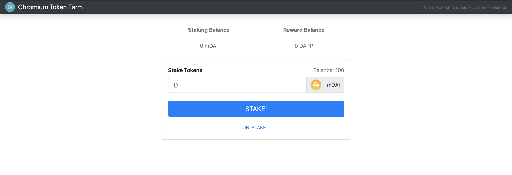

# Chromium Token Farm

The Chromium Token Farm is a DeFi POC illustrating the use of Mock DAI and DAPP tokens to emulate a DeFi Blockchain Application to stake and unstake Tokens.

Lists of Solidty Contracts:

-   mDAI Contract
-   DAPP Contract
-   Chromium Farm Contract

## Illustration 

